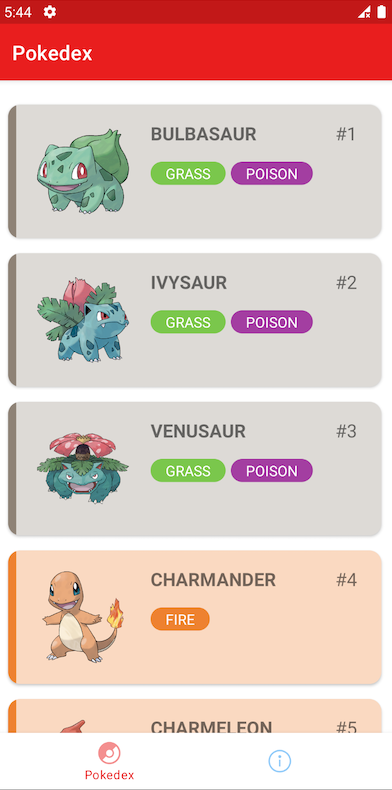
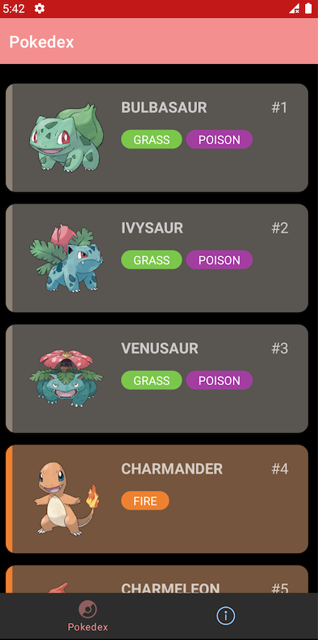
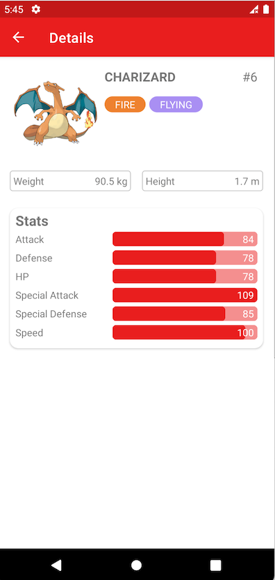

# Pokedex
Pokedex Android app written in Kotlin.

## Data
Data retrieved from [PokeApi](https://pokeapi.co)

## Libs
- Koin (DI)
- Glide 
- Retrofit2
- Moshi
- Android Navigation 
- Room 
- Android Paging Library
- WilliamChart

## Preview images
 
 
 

## Video preview
https://www.youtube.com/watch?v=iq3laR18Yk4